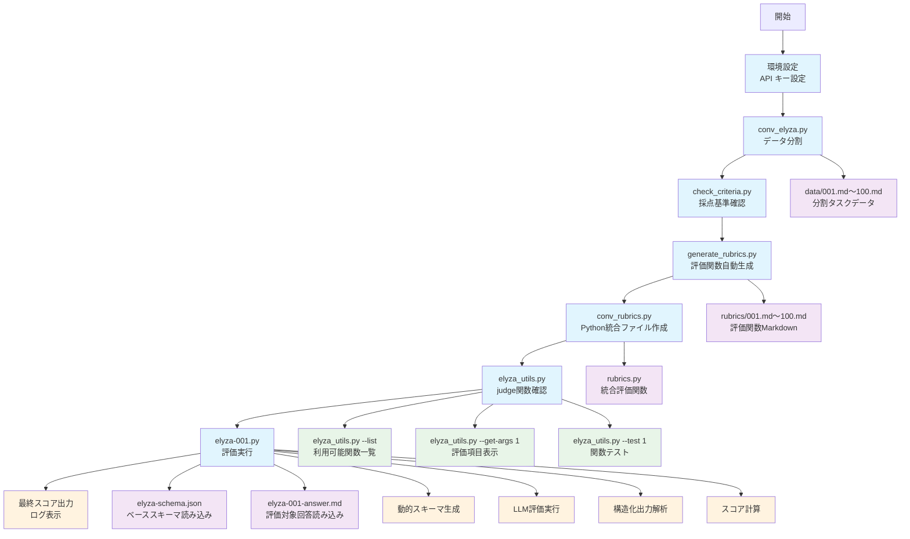

# 2elyza - ELYZA-tasks-100 データ処理システム

## 概要

このディレクトリには、ELYZA-tasks-100ベンチマークを従来型評価システムから構造化出力評価システムに変換するためのツールとデータが含まれています。

**背景**: Tengu Benchで開発・実証された構造化出力評価手法をELYZA-tasks-100に適用し、計算精度の向上、形式保証、効率性の改善を実現しました。

**注**: このREADMEでは各ツールの代表的なコマンド例のみを掲載しています。詳細な使用方法やオプションについては、各ツールのドキュメント（`{tool_name}.md`）を参照してください。

## ツール使用フロー



### フロー説明（6段階の変換プロセス）

1. **初期設定**: API キーの設定
2. **データ分割**: ELYZA-tasks-100データの個別ファイル分割（conv_elyza.py）
3. **評価基準抽出**: 問題固有採点基準の自動抽出・確認（check_criteria.py）
4. **評価関数生成**: 評価基準のPython関数自動化（generate_rubrics.py）
5. **Python統合**: 個別評価関数の統合と最適化（conv_rubrics.py）
6. **動的システム**: judge関数動的取得とスキーマ生成（elyza_utils.py）
7. **実証評価**: 構造化出力による実際の評価実行（elyza-001.py）

## ファイル構成

```
2elyza/
├── README.md                # このファイル
├── conv_elyza.py            # データ分割ツール
├── conv_elyza.md            # conv_elyza.pyの詳細ドキュメント
├── elyza-001.py             # 単一タスク評価実証スクリプト
├── elyza-schema.json        # ベース構造化出力JSONスキーマ（7つの基本評価項目）
├── elyza-001-answer.md      # 評価対象回答（gemini-2.5-flash-lite-preview-06-17）
├── elyza-001.md             # 001タスク実証スクリプトドキュメント
├── check_criteria.py        # 問題固有採点基準抽出ツール
├── check_criteria.md        # check_criteria.pyの詳細ドキュメント
├── generate_rubrics.py      # 評価基準自動コード化ツール
├── generate_rubrics.md      # generate_rubrics.pyの詳細ドキュメント
├── conv_rubrics.py          # 評価基準Markdown→Python変換ツール
├── conv_rubrics.md          # conv_rubrics.pyの詳細ドキュメント
├── elyza_utils.py           # ELYZA評価ユーティリティ（共用関数、judge関数動的取得、スコア計算）
├── elyza_utils.md           # elyza_utils.pyの詳細ドキュメント
├── rubrics-001.py           # 評価関数のfew-shot例（タスク001）
├── rubrics-002.py           # 評価関数のfew-shot例（タスク002）
├── data/                    # 生成されたファイル
│   └── 001.md～100.md       # 分割されたタスクデータ
├── rubrics/                 # 生成された評価関数
│   └── 001.md～100.md       # 各タスクの評価関数コード（Markdown形式）
├── rubrics.py               # 全ての評価関数を結合したPythonファイル
└── judge/                   # 評価結果
    └── {評価者}/{回答者}/
        └── 001.json～100.json
```

## ツール一覧

### データ準備

- **conv_elyza.py** - 2elyza.jsonからタスクデータを個別ファイルに分割

### 分析・確認

- **check_criteria.py** - 問題固有の採点基準を抽出・表示

### コード生成

- **generate_rubrics.py** - 評価基準をPython関数として自動コード化
- **conv_rubrics.py** - 評価基準Markdownファイルを結合した実行可能なPythonファイルに変換

### 実証・検証

- **elyza-001.py** - 単一タスク（001）での構造化出力評価実証（汎用関数利用、ログ出力対応）

### ユーティリティ

- **elyza_utils.py** - ELYZA評価ユーティリティ（共用関数、judge関数動的取得、スコア計算、スキーマ生成）

## 使用手順

### 1. 環境設定
```bash
export GOOGLE_API_KEY="your-gemini-api-key"  # Gemini使用時
export OPENAI_API_KEY="your-openai-api-key"  # OpenAI使用時
```

### 2. データ準備（初回のみ）
```bash
# タスクデータの分割
uv run conv_elyza.py
```

### 3. 採点基準の確認
```bash
# 問題固有の採点基準を表示
uv run check_criteria.py
```

### 4. 評価関数の生成
```bash
# 評価基準をPython関数として自動コード化
uv run generate_rubrics.py --all

# MarkdownからPythonコードに変換（rubrics.pyを生成）
uv run conv_rubrics.py --all
```

### 5. 評価ユーティリティの使用
```bash
# 利用可能なjudge関数一覧を表示
uv run elyza_utils.py --list

# 特定タスクの評価項目を表示
uv run elyza_utils.py --get-args 1
```

### 6. 評価実行
```bash
# 単一タスク実証評価（デフォルトモデル）
uv run elyza-001.py
```

**注**: 評価対象の回答は`elyza-001-answer.md`から自動読み込みされます。異なる回答を評価したい場合は、該当ファイルの内容を変更してください。

詳細な使用方法は各ツールのドキュメント（`{tool_name}.md`）を参照してください。

## 技術的特徴

### 従来型評価システムからの構造化出力への変換
**従来システムの課題解決:**
- **計算ミス解消**: LLMの計算エラーを後処理で確実に補正
- **形式統一**: JSONスキーマによる厳密な出力制御
- **パース効率化**: 構造化データの直接利用
- **トークン節約**: Few-shot例の排除による効率化

**Tengu Bench手法の適用成果:**
- **評価スケール調整**: 10点満点 → 5点満点への適応
- **評価項目再設計**: 5項目階層構造 → 7要素個別評価
- **データ構造簡素化**: 複雑階層 → シンプル2要素構造
- **自動化強化**: 手動実装 → Few-shot学習による自動生成

### 実装された技術革新
- **汎用関数分離**: `calculate_score`、`load_and_prepare_schema`などの共用化
- **動的スキーマ生成**: ベーススキーマ + judge関数引数による実行時拡張
- **ASTベース解析**: 正規表現より確実なjudge引数抽出
- **ハードコーディング排除**: elyza_utilsによる完全動的評価システム
- **エラーハンドリング**: 無効なjudgeクエリに対する例外処理
- **ロギング機能**: judge関数呼び出しの詳細トレーシング
- **品質保証**: Few-shot学習による一貫した評価関数生成

詳細な技術仕様、実装の詳細、出力形式例については [elyza-001.md](elyza-001.md) を参照してください。

## 関連ドキュメント

### ツール詳細ドキュメント
- [conv_elyza.md](conv_elyza.md) - データ分割の詳細
- [check_criteria.md](check_criteria.md) - 採点基準抽出の詳細
- [generate_rubrics.md](generate_rubrics.md) - 評価基準自動コード化の詳細
- [conv_rubrics.md](conv_rubrics.md) - 評価基準Markdown→結合Python変換の詳細
- [elyza_utils.md](elyza_utils.md) - ELYZA評価ユーティリティの詳細
- [elyza-001.md](elyza-001.md) - 単一タスク実証評価の詳細

### 実装ガイドと技術仕様
- [../docs/20250626-dev-elyza-implementation.md](../docs/20250626-dev-elyza-implementation.md) - 従来型評価システムから構造化出力システムへの変換実装ガイド（ja-mt-bench-1shot等への適用手順）
