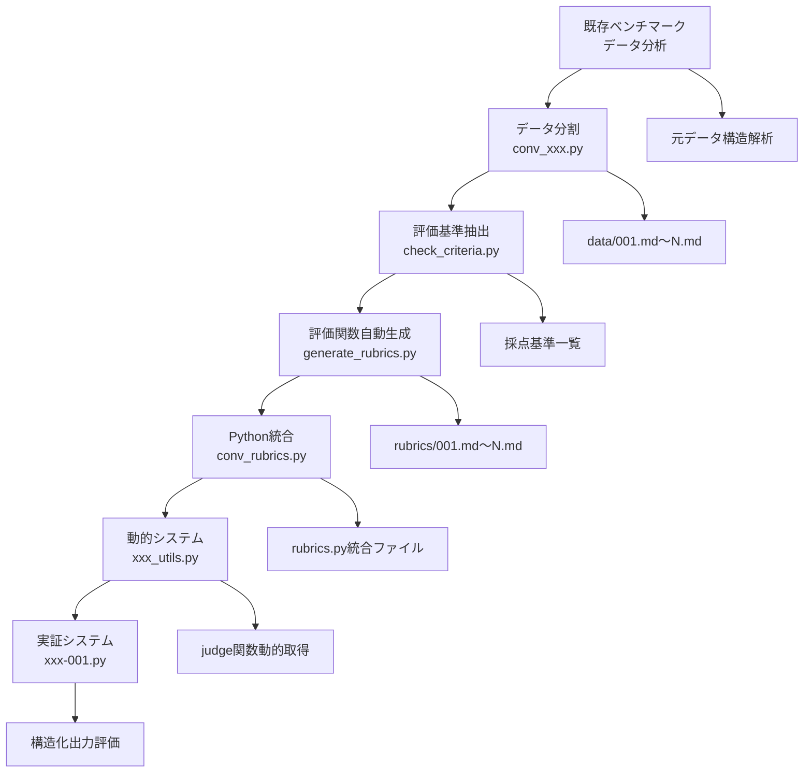

# 従来型評価システムから構造化出力システムへの変換実装ガイド

## 概要

本ドキュメントでは、ELYZA-tasks-100を例として、従来型のFew-shot評価システムを構造化出力評価システムに変換する実装手順を記録します。この手順は他のベンチマーク（ja-mt-bench-1shot等）への適用を想定した再利用可能なガイドとして設計されています。

## 背景：構造化出力評価システムとは

### 従来型評価システムの課題
1. **計算ミス**: LLMが評価項目の合計点を誤計算
2. **形式不統一**: 出力フォーマットが一貫しない
3. **パース困難**: 自由形式テキストからの情報抽出が複雑
4. **効率低下**: Few-shot例で不要なトークンを消費

### 構造化出力による解決
- **計算精度**: 後処理で確実に最終点を計算
- **形式保証**: JSONスキーマによる厳密な構造制御
- **効率処理**: 構造化データの直接利用
- **トークン節約**: Few-shot例が不要

## 実装フロー：6段階の変換プロセス



## 段階1: データ構造分析と分割戦略

### 目的
元のベンチマークデータから個別タスクファイルを生成し、構造化出力評価に適した形式に変換する。

### ELYZA-tasks-100の分析結果
```json
{
  "データ形式": "単一JSON行",
  "タスク数": 100,
  "評価形式": "1-5点",
  "Few-shot": "なし（2要素のみ）",
  "構造": "シンプル（text + expected_answer）"
}
```

### 実装パターン（conv_elyza.py）
```python
def convert_benchmark_data():
    """汎用的なデータ分割パターン"""
    # 1. 元データの読み込み
    with open("original_data.json") as f:
        data = json.load(f)
    
    # 2. 個別ファイル生成
    for i, task in enumerate(data, 1):
        task_id = f"{i:03d}"
        output_path = f"data/{task_id}.md"
        
        # 3. タスク固有フォーマットで保存
        with open(output_path, "w") as f:
            f.write(format_task_content(task))
```

### 他ベンチマークへの適用指針
- **ja-mt-bench-1shot**: マルチターン会話の階層構造対応が必要
- **tengu_bench**: 複雑な評価基準の構造解析が必要
- **do-not-answer**: 安全性評価の特殊フォーマット対応

## 段階2: 評価基準の抽出と分析

### 目的
各タスクの「問題固有の採点基準」を自動抽出し、構造化出力設計の基盤とする。

### ELYZA-tasks-100での実装（check_criteria.py）
```python
def extract_criteria(file_path):
    """評価基準抽出の汎用パターン"""
    # 1. ファイル読み込み
    with open(file_path, 'r') as f:
        content = f.read()
    
    # 2. 基準セクション検出（ベンチマーク固有）
    criteria_match = re.search(
        r'# 問題固有の採点基準\n(.*?)(?=\n#|$)', 
        content, re.DOTALL
    )
    
    # 3. 基準項目のリスト化
    if criteria_match:
        return parse_criteria_items(criteria_match.group(1))
```

### 他ベンチマークでの変更点
- **ja-mt-bench**: 「評価の観点」セクションを対象
- **tengu_bench**: 複数階層の基準構造に対応
- **カスタムベンチマーク**: 正規表現パターンをベンチマーク仕様に合わせて調整

## 段階3: 評価関数の自動コード生成

### 目的
抽出した評価基準を実行可能なPython関数として自動生成する。LLMのFew-shot学習により品質を保証。

### Few-shot例の設計原則
```python
# 統一インターフェース（全ベンチマーク共通）
def judge_XXX(score: int, judge: callable) -> int:
    """
    score: 基本スコア（評価システム依存）
    judge: 判定関数（query文字列を受け取りboolを返す）
    return: 調整後スコア
    """
    # 問題固有の減点処理
    if judge("具体的な減点条件"):
        score -= 1
    return score
```

### 自動生成システム（generate_rubrics.py）
```python
def generate_evaluation_function(task_number, criteria_list):
    """評価関数自動生成の汎用パターン"""
    # 1. Few-shot例の構築
    few_shot_examples = load_few_shot_examples()
    
    # 2. LLMプロンプト生成
    prompt = build_generation_prompt(
        task_number=task_number,
        criteria=criteria_list,
        examples=few_shot_examples
    )
    
    # 3. LLM実行と品質検証
    generated_code = llm_generate(prompt)
    return validate_and_save(generated_code, task_number)
```

### ベンチマーク別適応ポイント
- **スコア範囲**: ELYZA(1-5点) vs tengu(0-10点) vs ja-mt-bench(0-10点)
- **減点パターン**: 安全性 vs 正確性 vs 有用性
- **判定条件**: 文字列記述の特徴に応じた条件設計

## 段階4: Python統合とコード最適化

### 目的
生成された個別評価関数を単一のPythonファイルに統合し、実行時効率を最適化する。

### 統合処理（conv_rubrics.py）
```python
def integrate_evaluation_functions():
    """評価関数統合の汎用パターン"""
    all_functions = []
    
    for task_num in range(1, num_tasks + 1):
        # 1. Markdownからコード抽出
        code = extract_python_code(f"rubrics/{task_num:03d}.md")
        
        # 2. コメント削除と最適化
        clean_code = remove_comments(code)
        
        # 3. 元基準の注釈追加
        annotated_code = add_source_reference(clean_code, task_num)
        
        all_functions.append(annotated_code)
    
    # 4. 統合ファイル生成
    write_integrated_file(all_functions)
```

### 品質保証機能
- **構文検証**: Python ASTパーサーによる構文エラー検出
- **プログレス表示**: tqdmによる処理進捗可視化
- **エラーハンドリング**: ファイル存在チェックとスキップ処理

## 段階5: 動的システムの構築

### 目的
実行時にjudge関数とその引数を動的に取得し、ハードコーディングを完全排除したシステムを構築する。

### ASTベース解析システム（xxx_utils.py）
```python
def get_judge_function_and_args(task_number):
    """動的関数取得の汎用パターン"""
    # 1. rubrics.pyからの動的import
    import rubrics
    
    # 2. 関数名の動的構築
    function_name = f"judge_{task_number:03d}"
    
    # 3. 関数とソースコードの取得
    if hasattr(rubrics, function_name):
        judge_function = getattr(rubrics, function_name)
        source_code = inspect.getsource(judge_function)
        
        # 4. ASTパーサーによる引数抽出
        judge_args = extract_judge_args_from_ast(source_code)
        
        return judge_function, judge_args
    
    return None, []
```

### 動的スキーマ生成
```python
def load_and_prepare_schema(task_number):
    """動的スキーマ生成の汎用パターン"""
    # 1. ベーススキーマ読み込み
    with open("base-schema.json") as f:
        schema = json.load(f)
    
    # 2. judge引数の動的取得
    judge_func, judge_args = get_judge_function_and_args(task_number)
    
    # 3. タスク固有フィールドの追加
    for i, arg in enumerate(judge_args):
        add_dynamic_field(schema, f"q{i+1}", arg)
    
    return schema
```

## 段階6: 実証システムの実装

### 目的
構築したシステム全体を統合し、単一タスクでの動作確認を行う実証システムを作成する。

### 統合評価システム（xxx-001.py）
```python
def run_structured_evaluation(model, task_number=1):
    """構造化出力評価の汎用パターン"""
    # 1. 入力データの準備
    prompt = load_task_prompt(task_number)
    answer = load_model_answer()
    
    # 2. 動的スキーマ生成
    schema = load_and_prepare_schema(task_number)
    
    # 3. LLM評価実行
    evaluation_prompt = build_evaluation_prompt(prompt, answer)
    result_json = llm_generate_with_schema(evaluation_prompt, schema)
    
    # 4. スコア計算
    final_score = calculate_score(result_json, task_number)
    
    return final_score, result_json
```

### スコア計算ロジック
```python
def calculate_score(result_json, task_number):
    """スコア計算の汎用パターン"""
    evaluation = result_json["evaluation"]
    
    # 1. 基本スコア計算（ベンチマーク固有）
    base_score = calculate_base_score(evaluation)
    
    # 2. judge関数による問題固有減点
    judge_func, judge_args = get_judge_function_and_args(task_number)
    score = apply_judge_function(base_score, judge_func, evaluation)
    
    # 3. 共通減点処理
    score = apply_common_deductions(score, evaluation)
    
    return max(min_score, min(max_score, score))
```

## ベンチマーク適応における考慮事項

### Tengu Benchからの適用実績（ELYZA実装）

ELYZA-tasks-100の構造化出力システムは、Tengu Benchで開発・実証された手法を基盤として実装されました。主な適用変更点：

**評価スケールの調整**
- Tengu Bench: 0-10点の10段階評価
- ELYZA: 1-5点の5段階評価に調整
- スコア計算ロジックを5点満点仕様に変更

**評価項目の再設計**
- Tengu Bench: 5項目の階層構造（複雑な相互依存関係）
- ELYZA: 7要素の個別評価（独立した判定項目）
- より明確で判定しやすい評価基準に分解

**データ構造の簡素化**
- Tengu Bench: 複雑な評価基準の階層解析が必要
- ELYZA: シンプルな2要素構造（text + expected_answer）
- データ分割処理を大幅に簡素化

**自動化の強化**
- Tengu Benchでの手動実装経験を活かし、評価関数の自動生成システムを新規開発
- Few-shot学習による品質保証を実現

### ja-mt-bench-1shot への適用時の考慮事項

今後のja-mt-bench-1shot実装では以下の点を考慮する必要があります：

**評価スケール**
- 0-10点の10段階評価（Tengu Benchと同等）
- ELYZA実装のスコア計算ロジックを10点満点に調整

**マルチターン対応**
- 会話履歴を含む複数ターンの評価構造
- ターン間の一貫性評価項目の追加
- 会話文脈の理解度評価

**評価観点の調整**
- helpful（有用性）、harmless（無害性）、honest（誠実性）
- follow_instruction（指示遵守）、japanese_quality（日本語品質）
- ELYZA実装の7要素評価を5要素に再編成

**データ構造の複雑化**
- JSONL形式の会話データ解析
- マルチターン構造の分割処理
- 会話文脈を保持した評価プロンプト生成

### カスタムベンチマークへの適用指針

新しいベンチマークに構造化出力手法を適用する際の一般的な考慮事項：

**データ形式の分析**
- 元データ構造（JSON、JSONL、CSV等）の理解
- タスク数と評価項目数の把握
- Few-shot例の有無と構造の確認

**評価基準の抽出パターン**
- 「評価基準」「採点基準」「評価の観点」等のキーワード特定
- 正規表現パターンの調整
- 階層構造の解析とフラット化

**スコア体系の設計**
- 元の評価スケール（点数範囲）の確認
- 構造化出力に適した評価要素への分解
- 基本スコア + 減点方式の設計

**実装工数の見積り**
- データ分割の複雑度
- 評価基準の構造化難易度
- Few-shot例の作成工数
- テスト・検証の範囲

## 実装上の重要な設計原則

### 1. 段階的実装
- 各段階を独立したツールとして実装
- 前段階の出力を次段階の入力として利用
- 各段階でのエラーハンドリングと品質検証

### 2. 設定の分離
```python
# 各ベンチマーク固有の設定ファイル
benchmark_config = {
    "name": "elyza-tasks-100",
    "task_count": 100,
    "score_range": (1, 5),
    "data_file": "2elyza.json",
    "criteria_pattern": r"# 問題固有の採点基準\n(.*?)(?=\n#|$)"
}
```

### 3. エラーハンドリング戦略
- ファイル存在チェック
- JSON解析エラー対応
- LLM API呼び出し失敗時のリトライ
- 中間結果の保存とレジューム機能

### 4. テスト・検証機能
```python
# 各段階での検証コマンド
python conv_xxx.py --verify     # データ分割結果の検証
python generate_rubrics.py --test  # 生成プロンプトの確認
python xxx_utils.py --list      # 生成された関数の一覧
python xxx-001.py --dry-run     # 評価システムのドライラン
```

## 今後の展開と標準化

### 短期目標
1. **ja-mt-bench-1shot対応**: このガイドに基づく3mt実装
2. **汎用フレームワーク化**: 共通部分の抽象化
3. **設定駆動システム**: ベンチマーク固有部分の設定ファイル化

### 中期目標
1. **バッチ処理システム**: 全タスク一括評価機能
2. **品質比較分析**: 従来手法との定量的比較
3. **性能最適化**: 並列処理とキャッシュ機能

### 長期目標
1. **構造化出力評価の標準化**: 日本語LLM評価の統一手法確立
2. **多言語対応**: 英語等他言語ベンチマークへの拡張
3. **自動化パイプライン**: CI/CD統合による継続的評価

## 技術的教訓とベストプラクティス

### 成功要因
1. **段階的アプローチ**: 複雑なシステムを6段階に分割
2. **自動化の徹底**: 手動作業を最小限に削減
3. **動的システム設計**: ハードコーディングの完全排除
4. **Few-shot学習活用**: LLMによる高品質コード生成

### 技術的革新
1. **ASTベース解析**: 正規表現より確実な引数抽出
2. **動的スキーマ生成**: 実行時のjudge引数反映
3. **統一インターフェース**: ベンチマーク間の共通API
4. **品質保証システム**: 各段階での検証機構

### 設計上の配慮
1. **再利用性**: 他ベンチマークへの適用容易性
2. **拡張性**: 新しい評価項目の追加対応
3. **保守性**: 理解しやすいモジュール構造
4. **効率性**: 最小限のLLM API呼び出し

## 結論

このガイドに従うことで、任意の従来型評価ベンチマークを構造化出力システムに変換可能です。ELYZA-tasks-100での実装により確立された6段階の変換プロセスは、ja-mt-bench-1shot等の他ベンチマークへの適用において、開発効率の大幅向上と品質の一貫性を実現します。

構造化出力による評価システムは、計算精度、形式保証、効率性の面で従来手法を大幅に改善し、日本語LLM評価の新たな標準となる技術基盤を提供します。

## 関連資料

- [../2elyza/README.md](../2elyza/README.md): 実装されたツールの詳細
- [../2elyza/elyza-001.md](../2elyza/elyza-001.md): 実証システムの技術仕様
- [../2elyza/generate_rubrics.md](../2elyza/generate_rubrics.md): 自動コード生成の詳細
- [../2elyza/elyza_utils.md](../2elyza/elyza_utils.md): 動的システムの実装詳細